<div align="center">



</div>

<div align="center">



</div>

<div align="center">


</div>

---

<div align="center">

*Simulation-first platform for building an autonomous insulin dosing engine.*<br/>
*Iterate on glucose dynamics, decision logic, and safety constraints — in a controlled, non-clinical environment.*

</div>

---

## ⬡  Safety Boundary

> [!CAUTION]
> This is **simulation-only research software**. Nothing in this repository controls real insulin pumps, interfaces with CGM hardware, provides medical advice, or delivers treatment to any person. All outputs are synthetic. No clinical deployment before full regulatory validation.

---

## What This Is

SWARM Bolus is a **closed-loop simulation stack** that mirrors a real AID system architecture exactly — with every component replaceable by its hardware counterpart once pre-clinical validation is complete.

The dashboard offers three evaluation modes:

| Mode | Description |
|:--|:--|
| **Comparison** | Side-by-side A vs B: same algorithm, different clinical conditions. Produces comparative metrics and an AI-generated plain-English verdict. |
| **Profile Sweep** | One scenario across all 4 patient archetypes (standard, insulin-resistant, sensitive, rapid-onset). |
| **Retrospective Replay** | Load a real CGM trace (or a built-in reference pattern) and replay the controller against it. See what it *would have decided* — without affecting the actual glucose trajectory. |

---

## Architecture

<div align="center">



</div>

| Component | Role |
|:--|:--|
| **Physiology Engine** | Bergman 3-compartment model. Produces ground-truth glucose from patient params + meal events |
| **CGM Sensor Model** | Gaussian noise, interstitial lag, calibration drift. Outputs realistic 5-min sensor readings |
| **Controller** | Rule-based + ML-ready decision engine. Recommends bolus / basal adjustments |
| **Safety Layer** | IOB tracking, hypo prediction, stateful suspension logic, hard clamps. Blocks or clips unsafe dosing |
| **Pump Abstraction** | Delivery rate limits, infusion modeling, occlusion simulation |
| **Evaluation Engine** | Clinical metrics, scenario comparison, AI-generated verdict, Streamlit dashboard |
| **Retrospective Engine** | Loads real or reference CGM traces; replays controller with hypothetical IOB accumulation |
| **Explainability Engine** | Per-step `DecisionExplanation`: gate fired, reason, narrative. Rendered in interactive Decision Timeline |

---

## Clinical Metrics

Every simulation run emits a full clinical-grade metrics payload:

| Metric | Target | Description |
|:--|:--:|:--|
| `time_in_range` | **> 70%** | % of readings 70-180 mg/dL (ADA/EASD standard) |
| `cgm_mean` | 80-140 | Mean sensor glucose across window |
| `cgm_peak` | < 250 | Maximum excursion — hyperglycemia severity |
| `time_above_250` | < 1% | Severe hyperglycemia exposure |
| `glucose_sd` | < 36 | Glycemic variability — lower = more stable |
| `insulin_recommended` | — | Raw controller output pre-safety |
| `insulin_delivered` | — | Actual delivery post safety + pump model |
| `blocked_decisions` | → 0 | Requests fully rejected by safety layer |
| `clipped_decisions` | → low | Requests reduced (not blocked) by safety layer |

---

## Decision Explainability

Every step in every run can be expanded into a full **Decision Timeline** showing what the controller saw and why it acted:

```
┌─ t = 35 min ──────────────────────────────────────────
  cgm            : 191.0 mg/dL
  trend           : ↑  +1.60 mg/dL/min
  predicted +30   : 239.2 mg/dL
  IOB             : 0.000 U
├─ controller ──────────────────────────────────────────
  recommended     : 0.579 U
  reason          : predicted glucose above target
├─ safety ──────────────────────────────────────────────
  gate            : allowed ✓
  reason          : recommendation allowed
  status          : allowed
  final units     : 0.579 U
├─ delivery ────────────────────────────────────────────
  delivered       : 0.579 U
├─ narrative ───────────────────────────────────────────
  CGM 191 mg/dL (↑ +1.6/min) → pred 239 mg/dL at t+30 —
  delivered 0.58 U (full recommendation: 0.58 U).
└──────────────────────────────────────────────────────
```

Seven named safety gates — colour-coded in the timeline table:

| Gate | When it fires |
|:--|:--|
| `no_dose` | Controller recommended 0 U (glucose ≤ target) |
| `trend_confirmation` | Rising trend not yet confirmed over two consecutive steps |
| `hypo_guard` | Predicted glucose at t+30 < safety threshold |
| `iob_guard` | Active insulin on board exceeds the stacking limit |
| `max_interval_cap` | Recommendation clipped to per-interval maximum |
| `allowed ✓` | Full recommendation passed all gates and was delivered |
| `SUSPENSION` | Stateful hypo suspension is active (holds until confirmed recovery) |

---

## Retrospective Replay

Load a real CGM trace and replay the controller against it:

```bash
# Built-in reference traces
#   · Post-prandial Spike — 60g meal, missed bolus (110 → 239 → 134 mg/dL)
#   · Nocturnal Hypo      — overnight IOB, sensitive (90 → 57 → 78 mg/dL)
#   · Dawn Phenomenon     — cortisol rise, no meal (105 → 163 mg/dL)

# Custom trace — simple CSV format
echo "timestamp_min,glucose_mgdl" > my_trace.csv
# ...add rows...
# Upload via dashboard or paste into the text area
```

Supported input formats:
- **Simple CSV** — `timestamp_min,glucose_mgdl`
- **Dexcom G6/G7 Clarity export** — auto-detected by header; EGV rows filtered, timestamps converted to relative minutes

---

## Quickstart

```bash
# clone & install
git clone https://github.com/roninazure/autonomous-glucose-sim
cd autonomous-glucose-sim && pip install -r requirements.txt
```

```bash
# simulation engine
PYTHONPATH=src python -m ags.simulation.run

# controller
PYTHONPATH=src python -m ags.controller.run

# streamlit dashboard
streamlit run app.py

# test suite
PYTHONPATH=src pytest -q
```

---

## Structure

```
src/
└── ags/
    ├── simulation/       <- physiology engine · CGM model · scenario runner
    ├── controller/       <- decision engine · insulin recommendation logic
    ├── safety/           <- hard constraints · IOB tracking · hypo prediction
    ├── pump/             <- delivery abstraction · rate modeling
    ├── evaluation/       <- metrics · AI verdict · clinical report · profile sweep
    ├── retrospective/    <- CGM trace loader · reference traces · replay runner
    └── explainability/   <- DecisionExplanation · gate annotator · narrative generator

tests/                    <- 185 tests, all passing
docs/
experiments/
app.py                    <- Streamlit dashboard (Comparison · Profile Sweep · Retrospective Replay)
```

---

## FDA Pathway Strategy

Built from day one for a future **Software as a Medical Device (SaMD)** classification — likely **Class II** via FDA 510(k) or De Novo, comparable to existing hybrid closed-loop AID systems (Omnipod 5, Control-IQ).

<details>
<summary><b>01 · Algorithm Validation ✓</b></summary>
<br/>
- Large-scale simulation testing across diverse patient profiles<br/>
- Edge-case coverage: hypo/hyper extremes, missed meals, pump occlusions<br/>
- Cross-scenario repeatability and statistical robustness<br/>
- Profile sweep across 4 patient archetypes (standard, resistant, sensitive, rapid-onset)
</details>

<details>
<summary><b>02 · Safety Layer Maturity ✓</b></summary>
<br/>
- Insulin-on-board (IOB) modeling with 2-compartment PK/PD<br/>
- Stateful predictive hypoglycemia suspension with configurable resume margin<br/>
- 5 independent safety gates: no-dose, trend confirmation, hypo guard, IOB guard, interval cap<br/>
- Full auditability of every safety intervention via named gate identifiers
</details>

<details>
<summary><b>03 · Human Factors and Explainability ✓</b></summary>
<br/>
- Per-step <code>DecisionExplanation</code> capturing the full controller-safety-pump trace<br/>
- 7 stable gate identifiers with colour-coded dashboard timeline<br/>
- Plain-English narrative sentence per step (clinician-readable, no code required)<br/>
- Step drill-down: any timestep expandable into a full monospace audit card
</details>

<details>
<summary><b>04 · Clinical Evidence ✓</b></summary>
<br/>
- Retrospective replay against real CGM traces (CSV or Dexcom G6/G7 export)<br/>
- 3 built-in clinical reference patterns: post-prandial spike, nocturnal hypo, dawn phenomenon<br/>
- Hypothetical IOB accumulation tracking (counterfactual controller audit)<br/>
- Controlled simulation pilot studies via profile sweep
</details>

<details>
<summary><b>05 · Regulatory Filing</b></summary>
<br/>
- FDA 510(k) or De Novo pathway (predicated on final claims)<br/>
- Pre-submission meeting alignment<br/>
- Comparable device analysis vs. existing AID systems<br/>
- Design History File generation (in progress)
</details>

---

## Build Status

<div align="center">


</div>

---

## The Thesis

> *Build the decision engine first. Validate it in simulation. Then deploy it into reality.*

Insulin dosing is one of the most consequential, error-prone, and cognitively demanding tasks in chronic disease management. SWARM Bolus is the pre-clinical algorithm validation layer for a future fully autonomous insulin dosing brain — one that integrates with any CGM and pump, adapts per patient, continuously learns, and operates safely inside regulatory frameworks.

**One-line pitch:** We are building the decision engine that powers the future of autonomous insulin delivery — starting in simulation, validated before reality.

---

<div align="center">
<sub><b>SWARM Bolus</b> · simulation-first · safety-obsessed · clinically rigorous</sub>
</div>
